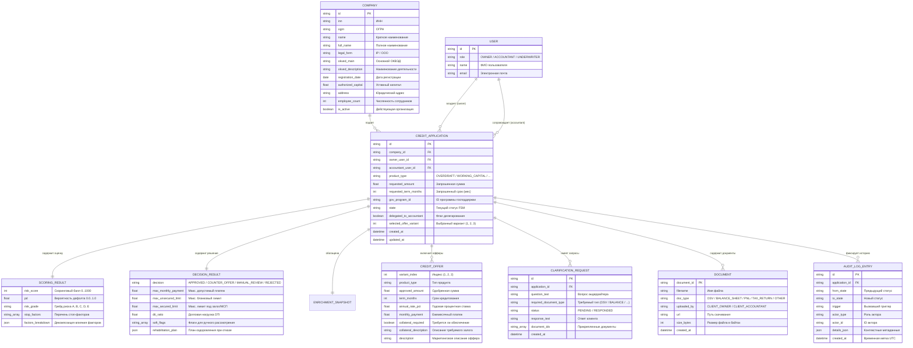

# Модель данных (Entity Relationship Diagram)

Модель данных спроектирована с учетом требований корпоративной безопасности и аудируемости банковских процессов.

---

## 1. ER-диаграмма (Mermaid)

```mermaid
erDiagram
    COMPANY ||--o{ CREDIT_APPLICATION : "подает"
    USER ||--o{ CREDIT_APPLICATION : "владеет (owner)"
    USER ||--o{ CREDIT_APPLICATION : "сопровождает (accountant)"
    
    CREDIT_APPLICATION ||--|| SCORING_RESULT : "содержит оценку"
    CREDIT_APPLICATION ||--|| DECISION_RESULT : "содержит решение"
    CREDIT_APPLICATION ||--|| ENRICHMENT_SNAPSHOT : "обогащена"
    CREDIT_APPLICATION ||--o{ CREDIT_OFFER : "включает офферы"
    CREDIT_APPLICATION ||--o{ CLARIFICATION_REQUEST : "имеет запросы"
    CREDIT_APPLICATION ||--o{ DOCUMENT : "содержит документы"
    CREDIT_APPLICATION ||--o{ AUDIT_LOG_ENTRY : "фиксирует историю"

    COMPANY {
        string id PK
        string inn "ИНН"
        string ogrn "ОГРН"
        string name "Краткое наименование"
        string full_name "Полное наименование"
        string legal_form "IP / OOO"
        string okved_main "Основной ОКВЭД"
        string okved_description "Наименование деятельности"
        date registration_date "Дата регистрации"
        float authorized_capital "Уставный капитал"
        string address "Юридический адрес"
        int employee_count "Численность сотрудников"
        boolean is_active "Действующая организация"
    }

    USER {
        string id PK
        string role "OWNER / ACCOUNTANT / UNDERWRITER"
        string name "ФИО пользователя"
        string email "Электронная почта"
    }

    CREDIT_APPLICATION {
        string id PK
        string company_id FK
        string owner_user_id FK
        string accountant_user_id FK
        string product_type "OVERDRAFT / WORKING_CAPITAL / ..."
        float requested_amount "Запрошенная сумма"
        int requested_term_months "Запрошенный срок (мес)"
        string gov_program_id "ID программы господдержки"
        string state "Текущий статус FSM"
        boolean delegated_to_accountant "Флаг делегирования"
        int selected_offer_variant "Выбранный вариант (1, 2, 3)"
        datetime created_at
        datetime updated_at
    }

    SCORING_RESULT {
        int risk_score "Скоринговый балл 0..1000"
        float pd "Вероятность дефолта 0.0..1.0"
        string risk_grade "Грейд риска A, B, C, D, E"
        string_array stop_factors "Перечень стоп-факторов"
        json factors_breakdown "Декомпозиция влияния факторов"
    }

    DECISION_RESULT {
        string decision "APPROVED / COUNTER_OFFER / MANUAL_REVIEW / REJECTED"
        float max_monthly_payment "Макс. допустимый платеж"
        float max_unsecured_limit "Макс. бланковый лимит"
        float max_secured_limit "Макс. лимит под залог/МСП"
        float dti_ratio "Долговая нагрузка DTI"
        string_array soft_flags "Флаги для ручного рассмотрения"
        json rehabilitation_plan "План оздоровления при отказе"
    }

    CREDIT_OFFER {
        int variant_index "Индекс (1, 2, 3)"
        string product_type "Тип продукта"
        float approved_amount "Одобренная сумма"
        int term_months "Срок кредитования"
        float annual_rate_pct "Годовая процентная ставка"
        float monthly_payment "Ежемесячный платеж"
        boolean collateral_required "Требуется ли обеспечение"
        string collateral_description "Описание требуемого залога"
        string description "Маркетинговое описание оффера"
    }

    CLARIFICATION_REQUEST {
        string id PK
        string application_id FK
        string question_text "Вопрос андеррайтера"
        string required_document_type "Требуемый тип (OSV / BALANCE / ...)"
        string status "PENDING / RESPONDED"
        string response_text "Ответ клиента"
        string_array document_ids "Прикрепленные документы"
        datetime created_at
    }

    DOCUMENT {
        string document_id PK
        string filename "Имя файла"
        string doc_type "OSV / BALANCE_SHEET / PNL / TAX_RETURN / OTHER"
        string uploaded_by "CLIENT_OWNER / CLIENT_ACCOUNTANT"
        string url "Путь скачивания"
        int size_bytes "Размер файла в байтах"
        datetime created_at
    }

    AUDIT_LOG_ENTRY {
        string id PK
        string application_id FK
        string from_state "Предыдущий статус"
        string to_state "Новый статус"
        string trigger "Вызвавший триггер"
        string actor_type "Роль актора"
        string actor_id "ID актора"
        json details_json "Контекстные метаданные"
        datetime created_at "Временная метка UTC"
    }
```
